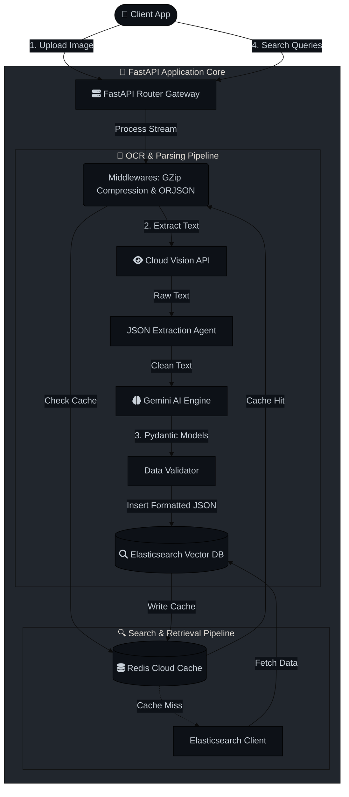

This document details the complete end-to-end flow of the **AI OCR Service**, encompassing data ingestion, processing, and intelligent retrieval, alongside the architectural optimizations implemented for production-grade reliability and latency.

## High-Level System Architecture

The AI OCR Service relies on an asynchronous event-driven core constructed via FastAPI. It connects a frontend client to Google's Cloud Vision (OCR) and Gemini (LLM Analysis), ultimately resting standardized data within Elasticsearch for sub-millisecond querying.



# Project Architecture & Flow

This document details the complete end-to-end flow of the **AI OCR Service**, encompassing data ingestion, processing, and intelligent retrieval.

## 1. High-Level System Architecture

```text
               ┌─────────────────────────────┐
               │         Client Layer        │
               │    (Web / App / Frontend)   │
               └──────────────┬──────────────┘
                              │
                              ▼
               ┌─────────────────────────────┐
               │       FastAPI Backend       │
               │        (app/main.py)        │
               │  [GZip & ORJSON Middleware] │
               └───────┬──────────────┬──────┘
         ┌─────────────┼──────────────┼─────────────┐
         ▼             ▼              ▼             ▼
  ┌──────────────┐ ┌────────┐ ┌─────────────┐ ┌─────────────┐
  │AI Chat       │ │OCR     │ │Search       │ │Redis Cloud  │
  │Service       │ │Service │ │Service      │ │& Elasticsearch│
  │(chat/)       │ │(ocr/)  │ │(search/)    │ │Pools        │
  └──────────────┘ └────────┘ └─────────────┘ └─────────────┘
```

## Implementation of Production Optimizations

To ensure the backend runs at production-grade speeds, the architecture leverages 7 core optimization techniques specifically positioned across the pipeline:

1. **Connection Pooling (`app/core/elasticsearch.py` & `app/core/cache.py`)**
   - Both Elasticsearch and Redis (Cloud) clients are instantiated as persistent global Singletons. Redis maintains a `max_connections=50` pool, averting the massive latency overhead of opening new TCP handshakes for each API request.

2. **Distributed Caching (`app/core/cache.py`)**
   - The Search Service utilizes `@cached(ttl=120, key_prefix="search_fuzzy")` decorators which sit directly in front of the Elasticsearch queries. This intercepts thousands of identical search queries (like autocomplete typos) instantly via Redis Cloud RAM without taxing the Vector DB.

3. **Avoiding N+1 Queries (`app/services/search/search_indexer.py`)**
   - The Elasticsearch indices are intentionally denormalized. A single query seamlessly pulls parent Prescription IDs strictly bundled with all their nested properties (`medicine_names`, `diagnosis`), preventing secondary mapping database fetches.

4. **Pagination Bounds (`app/api/search.py`)**
   - Through explicit Pydantic routing schemas (`size: int = Query(10, le=100)`), the API fundamentally blocks clients from requesting un-paginated infinite lists, securing the server against Out-Of-Memory (OOM) load spikes.

5. **JSON Serialization (`app/main.py`)**
   - We configured `CustomORJSONResponse` as the default application serialization Engine. It delegates JSON parsing from generic Python to highly-optimized, compiled Rust (`orjson`), drastically accelerating large array rendering.

6. **Payload Compression (`app/main.py`)**
   - Hooked `GZipMiddleware(minimum_size=1000)` atop the FastAPI stack. It dynamically intercepts any outbound JSON payload larger than 1KB and compresses it via Level 6 compression, cutting Network transmission times for large search returns by up to 80%.

7. **Asynchronous Thread-Safe Logging (`app/core/logger.py`)**
   - Swapped standard blocking logging for `loguru(enqueue=True)`. Disk File IO writes are dispatched to a separate parallel thread queue, assuring the primary main thread never pauses to wait for log persistence during heavy traffic.

## Detailed Request Flows

### Flow 1: OCR Extraction & Persistence

1. **Request:** Client application sends a multipart form containing a hand-written medical prescription image.
2. **Vision Extraction:** FastAPI pipes the binary image to Google Cloud Vision API. Cloud Vision performs strict Document Text Extraction, returning raw, unstructured String blocks.
3. **LLM Structuring (Gemini):** The raw string block is dispatched to a specialized LLM agent. Using strict prompting parameters, the LLM maps sentences into rigid `Pydantic` JSON models determining `medicine_names`, `diagnosis`, and the `doctor_name`.
4. **Vector Embedding:** The clean `Pydantic` schema generates a dense text-embedding vector (for Semantic Search capability) before being persisted into Elasticsearch index arrays.

### Flow 2: Intelligent Search Queries

1. **Request Formulation:** The Client triggers an `/api/v1/search/autocomplete` query (e.g., typing "Aspir...").
2. **Middleware Compression:** The FastAPI gateway opens the socket connection. The request immediately strikes the Redis Cache.
3. **Cache Resolution (Hit):**
   - If Redis contains the hashed exact query string locally (because a user searched it recently), Redis directly returns the ORJSON-serialized text payload back to the client natively.
   - *Time taken: ~20ms.*
4. **Cache Resolution (Miss):**
   - If Redis misses the document, the Asynchronous ES Client invokes a `bool_prefix` Query combined with a Typos-Tolerant fuzziness metric (`AUTO:1`).
   - Elasticsearch scans its Reverse Index Tree, locates the subset array, and directly retrieves the heavily nested JSON without executing an N+1 secondary loop.
   - The result is explicitly intercepted, cached into Redis with a 2-minute Time-To-Live (TTL), and broadcasted to the user.
5. **Serialization:** The final dictionary is dumped via the Rust-compiled `orjson` middleware and aggressively GZipped down to minimal transmission size before network dispatch.
