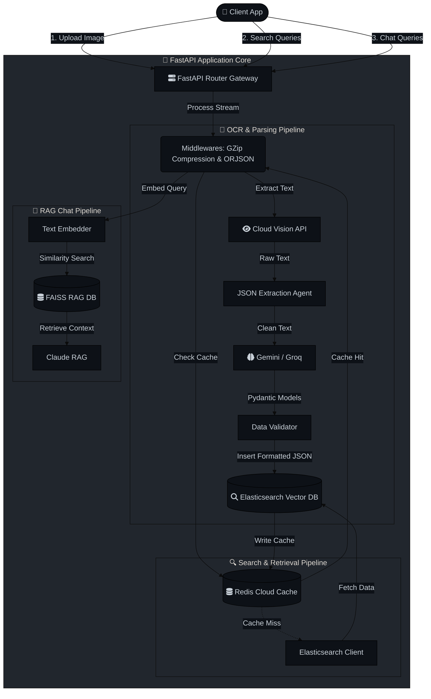
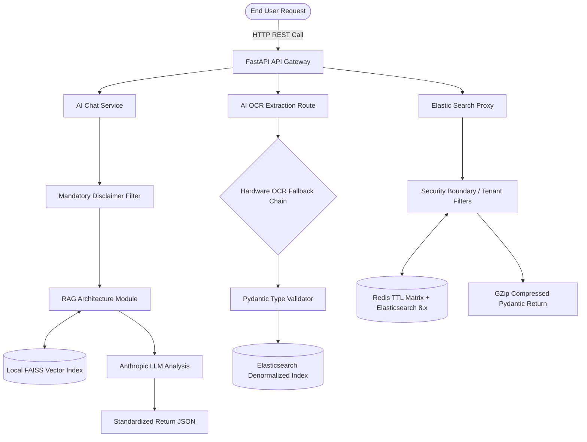

# AI_OCR_Service Workflow Documentation

This document describes the high-level architecture, processing workflow, and intelligent retrieval pipeline of the AI OCR & Search Service.

## 🚀 Overview

The AI OCR Service relies on an asynchronous event-driven core constructed via FastAPI. It connects a frontend client to Google's Cloud Vision (OCR) and Gemini (LLM Analysis), ultimately resting standardized data within Elasticsearch for sub-millisecond querying. It features a robust multi-tier OCR fallback system, an intelligent AI extraction layer, and a RAG-based FAISS Knowledge Base for generative chat capabilities.

## 🏗️ High-Level System Architecture

## 📸 1. OCR Pipeline (3-Tier Fallback)

The service implements a robust hardware and API fallback mechanism for text extraction, prioritizing absolute accuracy, then speed, and finally offline availability:

| Tier | Provider | Description | Characteristics |
| :--- | :--- | :--- | :--- |
| **Primary** | **Gemini 3.0 Flash** | Specialized OCR service. | Highest accuracy for medical handwriting. |
| **Secondary**| **Google Cloud Vision** | Cloud-based AI Vision model. | Fast, API-driven fallback. |
| **Tertiary** | **TrOCR** | Local ML Model (Transformer). | Offline fallback, no credentials required. |

### Extraction Flow

1. **Cleaning**: `ocr_cleaner.py` strips artifacts and auto-corrects systematic OCR hallucination errors.
2. **Structuring**: Clean text routes to an LLM (Claude/OpenRouter/Groq) leveraging a rigid prompt to map strings into structured `Pydantic` JSON schemas (medicines, dosages, providers).
3. **Data Persistence**: The structured JSON is embedded (for semantic similarity bounds) and ingested directly into **Elasticsearch** asynchronously.

## 💬 2. Knowledge Base Architecture (RAG for Chat)

The `/chat` service utilizes a **FAISS Vector DB** to execute context-aware Retrieval-Augmented Generation (RAG).

### 2.1 Admin Data Ingestion Flow

1. **Admin Uploads** domain knowledge or specific medical protocols.
2. **Data Cleaning & Chunking** breaks the source text into manageable semantic pieces.
3. **Embedding Generation** vectorizes the chunks computationally.
4. **Store in FAISS** (`index.faiss` + `index.pkl`) persisted directly on the local disk.

### 2.2 Query-Time Retrieval Flow

1. **User Query** is vectorized via the embedding layer.
2. **Similarity Search** computes nearest-neighbor distances against the FAISS index to retrieve Top-K reference documents.
3. **RAG Context**: The Top-K findings are bundled iteratively as strict context and passed to the LLM (Anthropic Claude).
4. **Medical Disclaimer**: The generated AI response is securely wrapped with an enforced medical liability disclaimer before reaching the user shell.

## 🔍 3. Search Engine Workflow (Security & Roles)

The search layer completely isolates End Users from backend data clusters via tight multi-tenant enforcement.

### 3.1 Role-Based Architectural Boundary

- **ADMIN USER**: Direct access interface to Kibana UI. Retains full privileges to create/delete indices, alter Data Views, monitor cluster nodes, and generate API Keys. Completely bypasses the FastAPI layer.
- **END USER**: Interacts exclusively through the FastAPI `/search` API. Denied structural visibility.

### 3.2 User Search Workflow (Restricted Execution)

1. **FastAPI Endpoint**: User calls a sub-route, e.g., `/search/medicine?q=Aspirin`.
2. **Application Authentication**: Checked explicitly by API Security protocols.
3. **Scoped API Key Generation**: FastAPI communicates using an obscure Elasticsearch API key, scoped strictly to `read`/`search` privileges by the Admin for specific restricted indices.
4. **Targeted Querying**: The framework applies immutable backend filters: `user_id` multi-tenant boundaries (User A cannot view User B’s records), restrictive date ranges, and typo-tolerant nested `bool_prefix` matches.
5. **Production Hardening**: The Elasticsearch cluster connects only via TLS, the Kibana UI sits behind a VPC/VPN, and credentials exist exclusively as runtime Environment memory secrets.

## 🚀 4. Implementation of Production Optimizations

To handle simultaneous requests with production-grade latency, 7 pivotal application optimizations are integrated:

1. **Connection Pooling (`app/core/elasticsearch.py` & `app/core/cache.py`)**: Elasticsearch and Redis Cloud clients act as global Singletons. Redis utilizes `max_connections=50`, discarding the heavy latency overhead of repeatedly establishing TCP handshakes.
2. **Distributed Caching (`app/core/cache.py`)**: `@cached(ttl=120)` decorators guard Elasticsearch. Identical queries (like recurring autocomplete API pings) hit Redis Cloud proxy RAM and are returned under 20ms without waking Elasticsearch.
3. **Avoiding N+1 Queries**: Elasticsearch mappings are heavily denormalized. One query intrinsically pulls the patient and all nested `medicine_names` continuously.
4. **Pagination Bounds (`app/api/search.py`)**: Active enforcement of result limits via `size: int = Query(10, le=100)`, defending backend pipelines against API abuse and Out-Of-Memory (OOM) loading conditions.
5. **JSON Serialization (`app/main.py`)**: Outputs are globally routed through `CustomORJSONResponse`. This bypasses strict Python evaluation, utilizing compiled Rust (`orjson`) to speed up intensive array serialization.
6. **Payload Compression (`app/main.py`)**: `GZipMiddleware(minimum_size=1000)` filters outbound JSON payloads above 1KB, dropping packet traversal sizes up to 80% with Level 6 GZip compression.
7. **Asynchronous Thread-Safe Logging (`app/core/logger.py`)**: Standard logging is replaced with non-blocking `loguru(enqueue=True)`. Disk File IO drops to an isolated worker thread avoiding GIL main-loop locking.

## 📊 5. Complete End-to-End Production Workflow

This workflow maps the full multi-tier architecture, validating a service built exclusively for stable, async data manipulation and high-availability enterprise staging.
