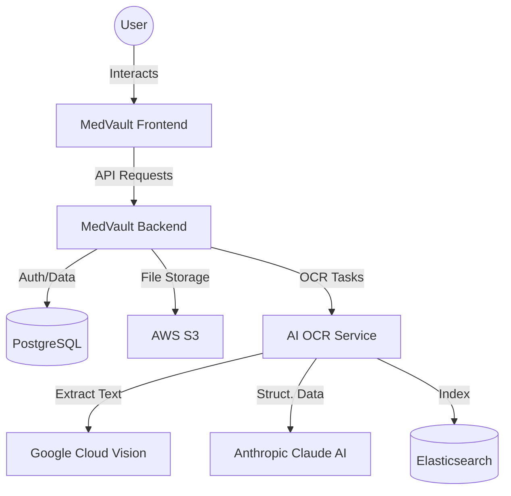

# MedVault 🏥

**MedVault** is a modular, AI-powered medical data platform designed to securely store, manage, and extract intelligence from medical records.

## 🚀 Overview

MedVault 0.2 leverages a microservices architecture to provide a seamless experience for both patients and healthcare providers. It features an AI-driven OCR service to digitize prescriptions, a robust backend for record management, and a modern mobile interface.

### 🏗 Architecture



## 🛠 Services

| Service | Technology | Description |
| :--- | :--- | :--- |
| **[AI_OCR_Service](./AI_OCR_Service)** | FastAPI, Python | OCR + Document Intelligence with Google Vision & Claude AI. |
| **[MedVault-Backend](./MedVault-Backend)** | Node.js, Express | Core API Gateway, Auth, and Record Management (PostgreSQL). |
| **[MedVault-frontend](./MedVault-frontend)** | React Native, Expo | Cross-platform Mobile Application. |

## 📦 Getting Started

### Prerequisites

- **Docker & Docker Compose**
- **API Keys Required**:
- **Google Cloud**: Service Account JSON (Vision API enabled).
- **Anthropic**: API Key (Claude AI).
- **AWS**: Access/Secret Keys (S3 Bucket).

### Setup & Installation

1. **Clone the repository**:

   ```bash
   git clone https://github.com/asarittechnologies/MedVault.git
   cd MedVault-0.2
   ```

2. **Configure Environment Variables**:
   Update the `.env` files in each service directory:
   - `AI_OCR_Service/.env`
   - `MedVault-Backend/.env`

3. **Start the full stack**:

   ```bash
   docker-compose up --build
   ```

## 🔐 Security & Storage

- **Authentication**: JWT-based secure user sessions.
- **Records Storage**: Encrypted storage links in PostgreSQL with files hosted on AWS S3.
- **Search**: Advanced indexing of medical records using Elasticsearch for rapid retrieval.

## 📄 License & Author

**Author**: Irakam Siva Venkata Bhanu Prakash, Mandali Akash, Gujjala Pranay Kumar & Asarit Technologies
**Version**: 0.2
